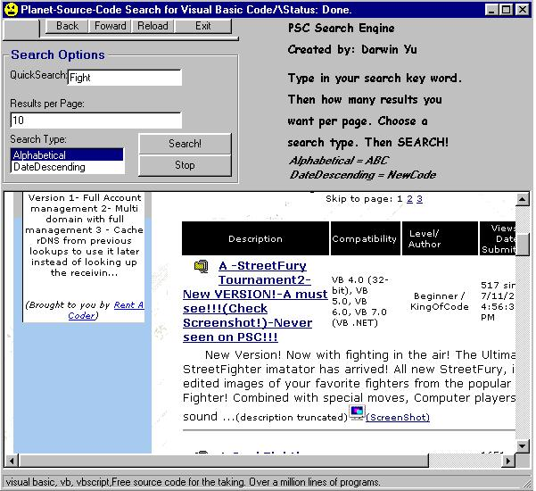



## A simple yet very effieient PSC search engine\! Quick and easy\! A must see, check out the screenshot\!

### Description

A simple yet vrey effieient PSC search engine! Features different searches, how many results, alphabetical, or newest code! Check it out! Small download, definently worth your time! A vote will be appreciated.
 
### More Info
 

             |
---                |---
**Submitted On**   |2001-07-14 19:03:46
**By**             |[LordsOfGames](https://github.com/Planet-Source-Code/PSCIndex/blob/master/ByAuthor/lordsofgames.md)
**Level**          |Beginner
**User Rating**    |4.0 (12 globes from 3 users)
**Compatibility**  |VB 3\.0, VB 4\.0 \(16\-bit\), VB 4\.0 \(32\-bit\), VB 5\.0, VB 6\.0
**Category**       |[Internet/ HTML](https://github.com/Planet-Source-Code/PSCIndex/blob/master/ByCategory/internet-html__1-34.md)
**World**          |[Visual Basic](https://github.com/Planet-Source-Code/PSCIndex/blob/master/ByWorld/visual-basic.md)
**Archive File**   |[A simple y227897142001\.zip](https://github.com/Planet-Source-Code/lordsofgames-a-simple-yet-very-effieient-psc-search-engine-quick-and-easy-a-must-see-check__1-25023/archive/master.zip)

